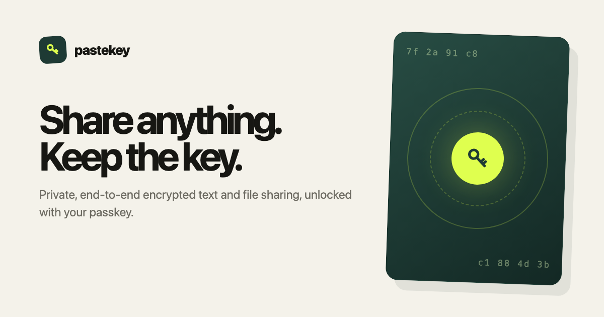

# Pastekey

[](https://github.com/angristan/pastekey/actions/workflows/ci.yml)

**Passkey-only, end-to-end encrypted text and file sharing.**



Pastekey creates an encrypted vault unlocked by your passkey. Paste text, upload files, or create revocable share links without giving the application backend plaintext content or usable content keys.

## Features

- Passkey-only registration and unlock using the WebAuthn PRF extension
- Independent AES-256-GCM keys for every item and attachment
- Encrypted titles, formats, filenames, MIME types, text, and file contents
- Standalone file drops and text pastes with optional attachments
- Share secrets kept in URL fragments, outside HTTP requests
- On-demand local previews for text and passive image, audio, and video formats
- Expiration, share revocation, backup passkeys, and durable account deletion
- Responsive, installable web interface with privacy-safe generic link previews

## Security model

Encryption and decryption happen in the browser. The backend stores ciphertext and wrapped keys only, **assuming the delivered JavaScript is trusted**.

```text
Passkey PRF ──HKDF──> passkey wrapping key
                         │ unwraps
                         ▼
                   account key
                         │ unwraps
                         ▼
                  per-item random key ──AES-GCM──> encrypted item
                         │
                         ├── wraps independent file keys ──AES-GCM──> R2 ciphertext
                         └── wrapped by a share key from the URL #fragment
```

- Each passkey wraps the account key independently.
- Each paste or file drop has a random item key; each attachment has another random key.
- Item type, title, format, and text are encrypted together. Legacy payloads remain readable.
- Share links expose an opaque share ID in the path, while the decryption secret stays after `#` and is never sent to the server.
- Revocation deletes the wrapped item-key envelope. It cannot revoke plaintext already copied by a recipient.
- Active formats such as HTML, SVG, and XML are never embedded as previews.
- Removing a passkey is atomic and cannot remove the account's final credential.
- Account deletion requires recent passkey verification before access is revoked.

### Trust boundary and limitations

Pastekey does not protect against a compromised device, browser extension, dependency, or modified application JavaScript. Cloudflare and the network still observe normal request metadata, including IP-level traffic information and ciphertext sizes.

D1 and R2 retain operational metadata such as opaque IDs, account/item/file counts, timestamps, expiration, and ciphertext sizes. Analytics Engine receives only fixed operation names, outcomes, coarse encrypted-file size buckets, duration, and HTTP status—never paths, identifiers, IP addresses, filenames, or content. Custom Worker spans likewise use fixed business-operation names and record only trigger type, queue kind, batch size, and failure state; Cloudflare's automatic tracing still observes normal platform request and binding metadata.

Losing every passkey means losing the vault. There is no server-side recovery or password reset.

Shared URLs use generic Open Graph metadata and are served with `noindex`; encrypted titles, filenames, content, and fragment secrets are never used for link previews.

## Architecture

```text
Browser (React host + Effect services)
  ├── WebAuthn PRF + WebCrypto
  ├── plaintext and keys remain local
  └── URL-fragment share secret
          │ ciphertext only
          ▼
Cloudflare Worker (Hono host + Effect services)
  ├── D1: users, credentials, sessions, ciphertext metadata, deletion outbox
  ├── R2: encrypted attachment bodies
  ├── Queues + DLQ: retryable routine deletion
  ├── Workflows: durable account deletion
  ├── Flagship: new-account registration control
  └── Analytics Engine: identifier-free operational events
```

The codebase is feature-oriented:

```text
shared/
├── protocol/            # Stable wire-format types
└── schema/              # Effect schemas for untrusted boundaries

src/
├── components/          # Shared UI and React host adapters
├── crypto/              # Promise compatibility adapters
├── effect/              # Typed API, crypto, and WebAuthn services
├── features/            # Auth, vault, composer, and public sharing
└── lib/                 # Downloads, uploads, formatting, and protocol helpers

worker/
├── routes/              # Thin Hono HTTP and authorization adapters
├── middleware/          # Security, rate limiting, and analytics
├── platform/            # Typed D1 and Cloudflare Effect services
├── repositories/        # Schema-decoded persistence operations
├── services/            # Sessions, auth, cleanup, and deletion recovery
├── workflows/           # Durable account deletion host adapter
└── lib/                 # Validation, encoding, and configuration
```

Fallible asynchronous application logic uses Effect with typed failures and cancellation. React, Hono, Queues, and Workflows remain host adapters. Native `D1Database.batch()` stays behind the typed D1 platform service so atomic writes and `meta.changes` semantics remain intact.

D1 conditional writes and upload reservations enforce item, file-count, and storage quotas under concurrency. Routine R2 deletion uses a transactional D1 outbox, Queue retries, and an actively consumed dead-letter queue. Interrupted account-deletion Workflows are reconciled by scheduled cleanup.

## Requirements and compatibility

- [Bun](https://bun.sh/)
- A Cloudflare account with Workers, D1, R2, Queues, Workflows, Analytics Engine, Flagship, Turnstile, and Workers Rate Limiting
- A browser and passkey provider that expose the **WebAuthn PRF extension**

Ordinary passkey support is not enough; PRF support is mandatory. Test every browser/device combination you intend to rely on, and register a backup passkey where possible.

WebAuthn credentials are scoped to the RP ID. Changing `RP_ID` after registration requires users to register new credentials. The Worker compatibility date is deliberately pinned to `2026-07-15` and should only be changed after running the full verification suite.

## Local development

```bash
bun install
bun run db:migrate:local
bun run dev
```

Open the printed localhost URL. WebAuthn works on `localhost`, and Turnstile is bypassed locally when `TURNSTILE_SECRET_KEY` is absent. Local D1 state is stored under `.wrangler/`.

Flagship has no local flag store. `wrangler dev` evaluates against the live Flagship app configured by `app_id`; use a dedicated development app when production flag changes would be inappropriate.

## Self-hosting

> [!WARNING]
> `wrangler.jsonc` contains this deployment's database ID, hostname, RP settings, public Turnstile key, queue names, Analytics Engine dataset, Workflow name, and rate-limit namespace IDs. Replace them before deploying a fork. `bun run deploy` applies migrations to the configured **remote** D1 database.

### 1. Authenticate and provision storage

```bash
bunx wrangler whoami
bunx wrangler d1 create pastekey
bunx wrangler r2 bucket create pastekey-files
bunx wrangler queues create pastekey-deletions
bunx wrangler queues create pastekey-deletions-dlq
bunx wrangler flagship apps create pastekey
bunx wrangler flagship flags create <FLAGSHIP_APP_ID> registration-enabled --type boolean --default off --rule "serve=on; when=service equals pastekey"
```

Copy the new D1 database ID into `wrangler.jsonc`. Keep the `pastekey` database name or update the database name used by the migration scripts in `package.json`.

### 2. Configure Cloudflare resources

Update `wrangler.jsonc`:

- Custom domain and `ORIGIN`
- WebAuthn `RP_ID` and display `RP_NAME`
- D1 database ID and R2 bucket name
- Flagship app ID for the `FLAGS` binding
- Queue and dead-letter queue names
- Analytics Engine dataset and Workflow name
- Unique rate-limit namespace IDs
- Turnstile site key
- Optional quota variables

Create a Turnstile widget for the production hostname. The Workflow and Analytics Engine binding are deployed declaratively; D1, R2, and both Queues must already exist.

### 3. Add the Turnstile secret and deploy

```bash
bunx wrangler secret put TURNSTILE_SECRET_KEY
bun run deploy
```

The supported deployment command audits dependencies, runs type checking and the complete test suite, creates a production build, and performs a Wrangler dry-run. It then applies pending remote D1 migrations, deploys the Worker, and runs bounded read-only production smoke checks.

### Configuration

| Variable | Default | Purpose |
| --- | ---: | --- |
| `ORIGIN` | Request origin | Expected WebAuthn origin |
| `RP_ID` | Request hostname | WebAuthn relying-party ID |
| `RP_NAME` | `Pastekey` in this deployment | Passkey display name |
| `TURNSTILE_SITE_KEY` | None | Public registration widget key |
| `MAX_PASTES_PER_USER` | `100` | Encrypted item quota |
| `MAX_FILES_PER_PASTE` | `10` | Attachment quota per item |
| `MAX_FILE_BYTES` | `26214400` | Maximum encrypted file size (25 MiB) |
| `MAX_STORAGE_BYTES` | `104857600` | File storage quota per account (100 MiB) |
| `DELETION_QUEUE_NAME` | `pastekey-deletions` | Primary ciphertext deletion queue identity |
| `DELETION_DLQ_NAME` | `pastekey-deletions-dlq` | Deletion dead-letter queue identity |

`TURNSTILE_SECRET_KEY` is the only Worker secret. Do not commit it.

The `registration-enabled` Flagship boolean controls initial account registration only. Disable the flag to hide registration in newly loaded clients and reject both registration ceremony endpoints; sign-in and backup-passkey registration remain available. The default variant is deliberately `off`, while an enabled targeting rule serves `on`, so Flagship's enable/disable toggle acts as the kill switch. Evaluation defaults to enabled if Flagship is unavailable.

The configured rate limits are 20 authentication mutations and 30 write mutations per 60 seconds. Reads and downloads are not rate limited by the application.

## Commands

| Command | Purpose |
| --- | --- |
| `bun run dev` | Start local full-stack development |
| `bun run typecheck` | Run TypeScript checks |
| `bun run test` | Run unit and Workers integration tests |
| `bun run build` | Create a production build |
| `bun run preview` | Preview the production client build |
| `bun run verify` | Audit dependencies, test, typecheck, build, and dry-run deployment |
| `bun run db:migrate:local` | Apply local D1 migrations |
| `bun run db:migrate:remote` | Apply remote D1 migrations |
| `bun run deploy` | Verify, migrate remote D1, and deploy |
| `bun run smoke:production` | Run bounded read-only checks against production |

CI installs with the frozen Bun lockfile and runs `bun run verify` for pushes to `main` and pull requests.

## Operations and recovery

Apply D1 migrations before code that requires them and keep the previous Worker compatible with the migrated schema. A Worker rollback does not undo D1, R2, Queue, Workflow, or passkey state. For an application-only regression, use the project-pinned Wrangler to list deployments and roll back the Worker, then run the production smoke checks and verify registration state, sign-in, share retrieval, and account deletion status. For data corruption, stop writes and restore through the current D1 Time Travel procedure only after rehearsing against a disposable database; R2 ciphertext recovery must be handled and verified separately.

Routine ciphertext deletion is staged durably in `deletion_jobs`. The primary Queue retries five times before moving a message to the DLQ. The DLQ consumer retries persistence twelve times at five-minute intervals, then Cloudflare may discard that delivery. The hourly reconciliation job preserves correctness: a job whose `queued_at` remains stale for 25 hours is returned to the durable retry cycle with bounded backoff. When deletion failures persist:

1. inspect Workers Logs, the primary Queue, the DLQ, and the matching `deletion_jobs` row without exposing object keys or owner identifiers;
2. correct the D1, R2, Queue, or binding failure rather than replaying payloads manually;
3. let scheduled reconciliation redispatch stale work, or perform a reviewed D1 state repair only after recording the affected rows and rollback plan;
4. confirm the R2 object is absent and the durable job row is removed.

Record the Worker version, migration state, Queue retry cycle, Workflow status, recovery point, and smoke-test results for every production recovery.
